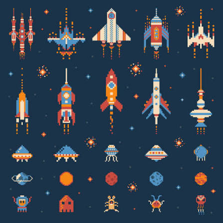

# Venture Star — SVG Asset Manifest Proposal

Status: inventory approved on 2026-09-06; all 190 generated SVG assets approved by the user on 2026-09-07. Direction: **Horizon Signal**, with **Deep Survey** radar language for maps and sensors.

All files are original pure SVG sources. Icons and sprites have transparent backgrounds; only starfields and explicitly opaque panels may contain backgrounds. Runtime colours come from approved palette tokens. App PNGs and Pixi atlases are generated from these sources and are not separate authored assets.

## Visual direction previews

### Supplied inspiration

Used for compact geometric silhouettes, small-scale readability, and its balanced navy/teal/coral/amber colour relationship. Production assets will not copy these ship designs or pixel-art geometry.

### Selected direction — Horizon Signal

The production set will use this original smooth-vector language: cream hull planes, strong navy outlines, teal navigation surfaces, amber energy and value cues, and coral damage or urgency cues.

### Secondary map language — Deep Survey

Radar rings, broken range contours, and directional signal markers from this option will be used selectively for sensors, targeting, danger bands, and toroidal route visualization.

## v0 authoring batches

| Batch | Files/patterns | Authored SVG count | ViewBox | Complexity route | Purpose |
|---|---|---:|---:|---|---|
| A01 Brand | `brand/logo-horizontal.svg`, `brand/mark.svg` | 2 | 512 | intricate | Venture Star wordmark and standalone compass-star mark |
| A02 Shell | `shell/starfield-{far,mid,near}.svg`, `loading-orbit.svg`, `compatibility.svg` | 5 | 64–1024 | standard | Layered space background, loader, unsupported-browser illustration |
| A03 Player ship | `ships/player/{base,thrust,braking,damaged,critical,destroyed}.svg` | 6 | 128 | intricate | One consistent flagship silhouette across all states |
| A04 Rival ship | `ships/rival/f1-{idle,thrust,damaged,destroyed}.svg` | 4 | 128 | intricate | Clearly distinct but equally capable rival scout |
| A05 Shipyard | `world/shipyard-{active,constructing,disabled,destroyed}.svg` | 4 | 256 | intricate | Orbital service and replacement-construction states |
| A06 Planets | `world/planet-{rocky,oceanic,verdant,arid,ice}.svg` | 5 | 256 | intricate | Five readable procedural planet families |
| A07 Ownership | `patterns/ownership-{player,neutral,rival1}.svg` | 3 | 32 | simple | Colour-independent ownership patterns and emblems |
| A08 Resource nodes | `world/node-{ore,metal,crystal}-{full,half,depleted}.svg` | 9 | 64 | standard | Three materially distinct resources and depletion states |
| A09 Asteroid hazard | `world/asteroid-field-{01,02,03,04}.svg`, `asteroid-warning.svg` | 5 | 256 | standard | Seam-compatible hazard field and warning boundary |
| A10 Positive discoveries | Two variants each for abandoned cargo and treasure asteroid, with reveal/claimed states | 14 | 128 | intricate | Strong early exploration rewards; no hazard-only discovery pool |
| A11 Flight/mining effects | Engine states for player/rival, mining strip/pulse, range-lock acquiring/locked/broken | 11 | 64–128 | standard | Thrust, braking, extraction rhythm, assisted station-keeping |
| A12 Sensor/damage effects | Scan normal/rare, four shield arcs, armour/hull hit pairs | 10 | 64–256 | standard | Deep Survey radar cues and readable layered damage |
| A13 Combat effects | Pulse projectile/muzzle/impact, bomb projectile/armed/shield/defence impact | 7 | 32–64 | standard | Auto-fire and manually confirmed consumable weapon feedback |
| A14 Explosions | `explosion-small-01..08.svg`, `explosion-large-01..08.svg` | 16 | 64/256 | standard | Transform-safe frame animation with shared shape language |
| A15 Strategic effects | Discovery reveal, ownership transfer, influence broadcast and reduced-motion counterparts, fuel reserve trail/badge | 8 | 64–256 | standard | Strategic consequences and accessibility-equivalent states |
| A16 HUD icons | 49 named icons from Spec §8.5.4 | 49 | 32 | simple | Complete navigation, resource, combat, map, settings, and save icon set |
| A17 Map language | Five danger hatches, two fog patterns, sensor edge, route arrow, wrap portal, four objective pins | 14 | 32–256 | simple/standard | Haven→Antipode danger bands and unmistakable toroidal routing |
| A18 UI chrome | Three nine-slice panels, six button states, six segmented meter shells, tooltip pointer, toast frame, focus ring | 18 | 32–128 | simple/standard | Responsive semantic HTML UI decoration; CSS handles plain rectangles |

**Total v0 authored SVG sources: 190.** Generation is divided across 18 cohesive batches. Repeated animation states share geometry and are validated together so the set remains consistent.

## Generated outputs from v0 sources

- App icons: 192, 512, maskable 192, maskable 512, and Apple touch 180 PNG.
- Lossless Pixi atlases at 1x/2x with two-pixel extrusion.
- Standalone optimized SVG logo and PNG fallback.
- Gallery thumbnails and validation contact sheets; these are review artifacts, not production assets.

## Deferred but reserved in the manifest

### v0.1

- Rival faction 2 scout states and patterns.
- Volcanic, gas, and artificial planets.
- Mining, fortress, research, and shipyard role glyphs.
- Exotic resource states.
- Ion storm tiles and lightning forms.
- Derelict and ancient-technology discoveries.
- Research, construction, capitulation, federation, and expanded discovery icons/effects.

### Full target

- Rival faction 3 scout states and pattern.
- Three cosmetic player flagship silhouettes using identical bounds/anchors.
- Six unique artifact discoveries.
- Wormhole states and transit effect.
- Expanded regional map and discovery motifs.

Deferred assets will not enter the v0 precache or distract from proving the first expedition loop.

## Cohesion constraints

- Horizon Signal navy outline and high-contrast cream hulls dominate vehicles and interface silhouettes.
- Teal communicates navigation, scanning, friendly systems, and ordinary positive state.
- Amber communicates value, energy, and progress.
- Coral communicates damage, destructive action, and urgent risk.
- Information never relies on hue alone: silhouette, emblem, hatch, motion, and text provide redundant meaning.
- Deep Survey rings/dashes appear only in scanning, targeting, routing, and danger visualization—not as decoration everywhere.
- No pixel-art stair steps, copied spacecraft silhouettes, faux military insignia, photorealism, or busy surface greebling.
